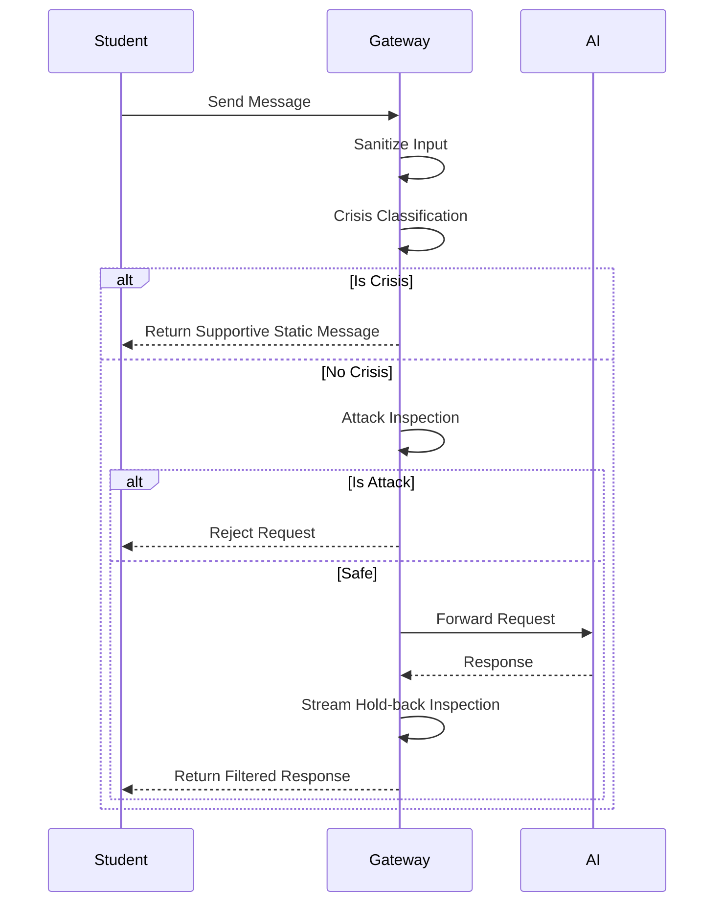

# SAIFE Gateway
Secure AI for Education (SAIFE) Gateway: Pedagogy-first security and safety for LLMs in schools.

[](https://github.com/FlorianSi/SAIFE-Gateway/actions/workflows/ci.yml)

## Why this exists

I am a former teacher now working in edtech, and I believe deeply in the potential of AI to support both educators and students. However, I’ve seen firsthand how difficult it is for schools to adopt generative AI safely. Between the risks of prompt injection, the complexities of data privacy laws, and the need for pedagogical guardrails, schools are often left either blocking AI entirely or adopting it without adequate protections.

I built the SAIFE Gateway to solve this problem transparently. By designing this gateway in collaboration with AI tools, every architectural and pedagogical decision has been carefully documented and scrutinized. My goal is to provide a robust, transparent layer of protection that sits between students and the underlying AI models, ensuring that safety and pedagogical integrity always come first.

This project is offered openly for educators, developers, and security researchers to use, challenge, and improve. It’s designed for strict compliance and built toward making AI in education as safe as possible. Please explore the code, read the rationale behind our design decisions, and join us in building a better, safer AI ecosystem for students.

## Project status

> [!WARNING]
> **ALPHA RELEASE**: This project is not production-ready and is absolutely not approved for use with real students yet. Expert reviews (legal, DPO, psychological) are currently pending. Please see the [Open Review Items](docs/OPEN_REVIEW_ITEMS.md) for details on blocking requirements.

## What SAIFE Gateway does

- **Crisis-aware supportive responses**: Immediately intercepts sensitive or harmful queries and provides static, supportive pedagogical guidance.
- **Prompt-injection defenses**: Employs robust pattern matching and validation to block malicious attacks from altering AI instructions.
- **Fail-closed design**: Defaults to maximum safety—if any validation or backend check fails, the gateway explicitly rejects the request.
- **GDPR-aligned data lifecycle**: Built on transient, in-memory state architecture to adhere to strict data minimization principles.
- **Audit trail**: Maintains secure, server-authoritative history of interactions for accountability without exposing student data.
- **Teacher-in-the-loop controls**: Empowers educators with monitoring and override capabilities to ensure the AI remains a helpful tool.

## Quickstart

**1. Install**
```bash
npm install saife-gateway
```

**2. Minimal Example**
```javascript
import { SaifeClient } from 'saife-gateway';

const saife = new SaifeClient({
  provider: {
    endpoint: process.env.AI_ENDPOINT || 'https://api.openai.com/v1/chat/completions',
    apiKey: process.env.AI_API_KEY || 'sk-test-key',
    model: 'gpt-4o'
  },
  pedagogy: {
    systemDirective: 'You are a helpful educational assistant.',
    focusTopics: { 'MATH': 'Mathematics' },
    studentMaxDailyRequests: 50,
    exemptions: []
  }
});

// See the Integration Guide for full usage details.
```

For a comprehensive guide, please refer to the [Integration Guide](docs/INTEGRATION_GUIDE.md).

## Architecture at a glance



Read more in the [Architecture Document](docs/ARCHITECTURE.md).

## Documentation index

| Document | Description |
|---|---|
| [Architecture](docs/ARCHITECTURE.md) | As-built system details, component map, and storage interfaces. |
| [Design Decisions](docs/DESIGN_DECISIONS.md) | Architecture Decision Records (ADR) and project rationale. |
| [Security Model](docs/SECURITY_MODEL.md) | Threat model, defenses, and fail-closed rules. |
| [Compliance](docs/COMPLIANCE.md) | GDPR & EU AI Act posture and data categorization. |
| [Integration Guide](docs/INTEGRATION_GUIDE.md) | Setup, configuration reference, and deployment notes. |
| [Open Review Items](docs/OPEN_REVIEW_ITEMS.md) | Pending expert reviews and blocking items for production. |
| [Glossary](docs/GLOSSARY.md) | Shared definitions for all terminology. |

## Contributing, Security, License

- [Contributing Guidelines](CONTRIBUTING.md) — Includes the fail-closed rule and fork naming clause.
- [Security Policy](SECURITY.md) — Instructions for responsible disclosure.
- **License:** MIT License. See [LICENSE](LICENSE) for details.
