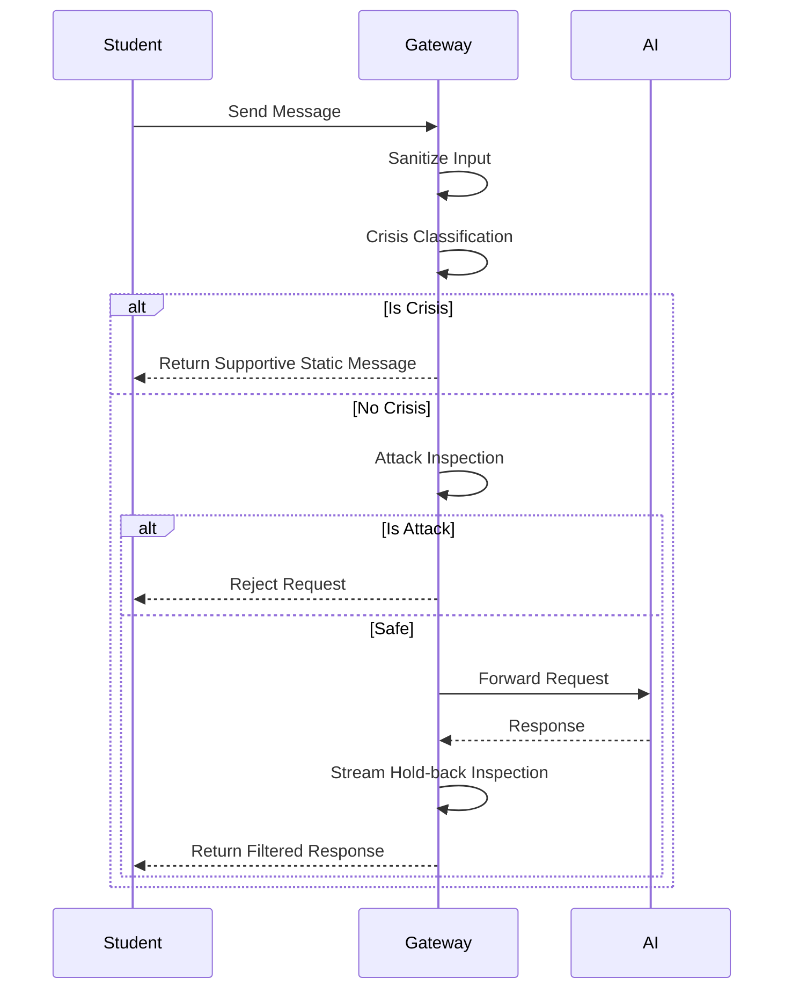

# SAIFE Gateway

<!-- [](https://github.com/FlorianSi/SAIFE-Gateway/actions/workflows/ci.yml) -->


*Pedagogy-first security and safety middleware for LLMs in schools.*

This document is the main entry point for the SAIFE Gateway project. Read this to understand the project's purpose, architecture, and how to get started.

**SAIFE Gateway** (Safe AI For Education) is an open-source middleware that sits between a school's learning platform and any Large Language Model (LLM) — such as those from OpenAI, Anthropic, or Google — and makes the conversation between students and the AI safer on both sides.

Before a student's message reaches the AI, the Gateway checks it: messages indicating a personal crisis receive an immediate, supportive response and alert a trusted adult at the school — they are never answered by the AI alone. Messages attempting to manipulate the AI (prompt injection) are blocked. Before the AI's answer reaches the student, it is inspected as it streams, so policy-violating content is withheld before it ever appears on screen.

Around this core, the Gateway handles what schools are legally required to get right: data minimization and retention schedules aligned with the GDPR, an append-only audit trail, redaction of personal data before prompts leave the school's infrastructure, and teacher-in-the-loop controls. It is written in TypeScript, installed via `npm install saife-gateway`, and connects to any LLM provider that passes its built-in compliance checklist.

**Current status: alpha.** This is a working proof of concept with a full test suite — but the expert reviews listed in [Open Review Items](docs/OPEN_REVIEW_ITEMS.md) are still pending, and it must not yet be used with real students.

Before adopting this project, read my own [honest assessment](docs/HONEST_ASSESSMENT.md) of what it does well, what it doesn't solve, and simpler alternatives worth considering.


## What SAIFE Gateway does

- **Crisis-aware supportive responses**: Immediately intercepts sensitive or harmful queries and provides static, supportive pedagogical guidance.
- **Prompt-injection defenses**: Employs robust pattern matching and validation to block malicious attacks from altering AI instructions.
- **Fail-closed design**: Defaults to maximum safety—if any validation or backend check fails, the gateway explicitly rejects the request.
- **GDPR-aligned data lifecycle**: Built on transient, in-memory state architecture to adhere to strict data minimization principles.
- **Audit trail**: Maintains secure, server-authoritative history of interactions for accountability without exposing student data.
- **Teacher-in-the-loop controls**: Empowers educators with monitoring and override capabilities to ensure the AI remains a helpful tool.

## Quickstart

**1. Install**
```bash
npm install saife-gateway
```

**2. Minimal Example**
```javascript
import { SaifeClient } from 'saife-gateway';

const saife = new SaifeClient({
  apiKey: process.env.AI_API_KEY || 'sk-test-key',
  focusTopics: { 'MATH_01': 'Algebra Basics' },
  providerConfig: {
    dpaExecuted: true,
    transferBasis: 'NONE',
    noTrainingClause: true,
    endpointRegion: 'EU'
  }
});

// See the Integration Guide for full usage details.
```

For a comprehensive guide, please refer to the [Integration Guide](docs/INTEGRATION_GUIDE.md).

## Architecture at a glance



Read more in the [Architecture Document](docs/ARCHITECTURE.md).

## Documentation index

| Document | Description |
|---|---|
| [Architecture](docs/ARCHITECTURE.md) | As-built system details, component map, and storage interfaces. |
| [Design Decisions](docs/DESIGN_DECISIONS.md) | Architecture Decision Records (ADR) and project rationale. |
| [Security Model](docs/SECURITY_MODEL.md) | Threat model, defenses, and fail-closed rules. |
| [Compliance](docs/COMPLIANCE.md) | GDPR & EU AI Act posture and data categorization. |
| [Integration Guide](docs/INTEGRATION_GUIDE.md) | Setup, configuration reference, and deployment notes. |
| [Open Review Items](docs/OPEN_REVIEW_ITEMS.md) | Pending expert reviews and blocking items for production. |
| [Glossary](docs/GLOSSARY.md) | Shared definitions for all terminology. |

## Contributing, Security, License

- [Contributing Guidelines](CONTRIBUTING.md) — Includes the fail-closed rule and fork naming clause.
- [Security Policy](SECURITY.md) — Instructions for responsible disclosure.
- **License:** MIT License. See [LICENSE](LICENSE) for details.
