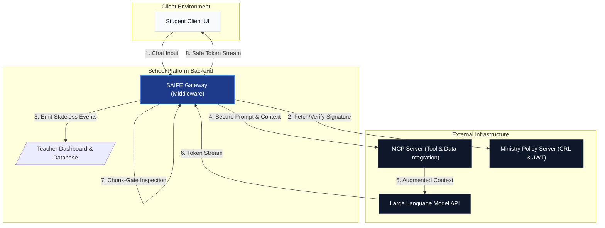

# SAIFE Gateway: The Technical & Pedagogical Blueprint
**Safe AI Framework for Education – Safely Unlocking the Potential of Generative AI in the Classroom**

---

## 1. Executive Summary

The deployment of generative AI in schools represents a paradigm shift in education. However, under the **EU AI Act**, AI systems used in educational and vocational training are classified as **High-Risk**. The challenge is twofold: how can schools ensure absolute safety (protecting minors from harmful content, inappropriate interactions, and crises) without crippling the pedagogical freedom of teachers?

The **SAIFE Gateway** (`@saife/gateway`) is an experimental, lightweight TypeScript middleware that sits between a school's digital learning platform and the underlying Large Language Model (LLM). SAIFE abandons fragile text-parsing methods in favor of **API-native isolation**, **cryptographic policy enforcement**, and **GDPR-compliant telemetry**.

> [!NOTE]
> **Persistent-State Free, Stateful Platform:** The Gateway process itself is "Persistent-State Free" (Zero Disk Retention). To prevent resource exhaustion, the SDK maintains a volatile, transient in-memory integer for rate-limiting. This transient memory contains no event payloads, no personal data, and no behavioral history, and is irrevocably destroyed upon process termination. However, the telemetry events it emits (Stream 1) are designed to be persisted by the school's platform backend. Platform operators are the Data Controller for all stored events and bear the corresponding GDPR obligations.

This paper serves as a technical specification for developers, a cryptographic guide for government authorities, and a conceptual blueprint for educators and policymakers.

---

## 2. The Core Concept: Separating Security from Pedagogy

Previous AI systems failed in schools because they mixed *safety* (e.g., preventing hate speech) with *didactics* (e.g., deciding whether to give a student the direct answer to a math problem). SAIFE strictly separates these concerns using a 4-layer architecture:

- **Layer 1 (The Ministry Policy - Security):** Cryptographically signed rules set by the government or educational board. This layer enforces absolute red lines (no self-harm, no violence, mandatory fallback behaviors). It cannot be bypassed by teachers or students.
- **Layer 2 (The AI Persona - Base Instruction):** The default educational baseline or character (e.g., "Helpful school assistant") that provides a consistent instructional tone.
- **Layer 3 (The Didactic DSL - Pedagogy):** A Domain-Specific Language (DSL) configured by the teacher. It contains separate controls like `didactic_mode` (e.g., Socratic dialogue vs. direct answers) and `ghostwriting_policy` (e.g., assisted outlining vs. full essay generation).
- **Layer 4 (The User Input):** The student's prompts and the active conversation history.

> [!TIP] 
> **🎯 For Schools & Teachers: Pedagogical Freedom** 
> By separating these layers, the framework guarantees that child protection (Layer 1) is uniformly enforced across all schools, while returning classroom autonomy (Layer 3) to you. If a student tricks the AI into revealing a homework solution, it is treated as a pedagogical feedback event on your dashboard, not a system-crashing security breach. You have full control over the `didactic_mode`.

---

## 3. Architecture Overview & Technical Sketch

The Gateway operates as an isolated middleware layer. To contextualize how it fits into a modern educational ecosystem—including external integrations via the Model Context Protocol (MCP)—please refer to the following architectural diagram:



*Figure 1: The SAIFE Gateway intercepts the flow between the student UI and the LLM, managing cryptographic verification and stream inspection while allowing data integration via an MCP Server.*

---

## 4. Repository Deep Dive: Components & Files

The SAIFE repository is structured into distinct modules to ensure a zero-trust, stateless execution pipeline. Below is a detailed breakdown of the `src` directory:

### `src/types/`
- **`api_types.ts`**: Defines the TypeScript contracts for the entire Gateway. This includes the Layer 3 Didactic DSL interfaces (`didactic_mode`, `ghostwriting_policy`), telemetry payload structures, and explicit frontend retraction events (`stream_abort`, `display_lifeline`).

### `src/security/`
- **`policy_verifier.ts`**: The cryptographic heart of Layer 1. This file is responsible for Ed25519 JWT verification. It syncs the local Certificate Revocation List (CRL) and evaluates the `nextUpdate` timestamp. It also implements the crucial **12-hour Fallback TTL**, ensuring the system fails-closed if the Ministry's server is unreachable for too long.

### `src/core/` (The Middleware Engine)
- **`saife_orchestrator.ts`**: The main entry point for the Gateway. It coordinates the execution pipeline, passing data between the policy verifier, the pre-flight gate, the LLM client, and the stream inspector.
- **`preflight_gate.ts`**: Analyzes the student's input *before* any request is sent to the LLM. It generates Confidence Scores to identify ambiguous statements (triggering Soft-Alerts) or acute crises (triggering Hard-Alerts).
- **`prompt_compiler.ts`**: Responsible for API-native isolation. It securely compiles the 4 layers (Layer 1 Safety, Layer 2 Persona, Layer 3 Didactic DSL) into a single system message wrapped in XML tags, alongside the Layer 4 User Input, preventing prompt injection attacks by neutralizing structural markup.
- **`stream_inspector.ts` (The Chunk-Gate)**: Intercepts the incoming stream from the LLM. It buffers tokens into small semantic chunks and verifies each chunk against the policy *before* releasing it to the frontend. This prevents "Salami-Slicing" exploits where the AI reveals a solution step-by-step.
- **`crisis_handler.ts`**: Activated during a Hard-Alert or a Chunk-Gate violation. It gracefully aborts the stream, wipes the frontend context, and delivers legally verified fallback responses ("lifelines").

> [!NOTE]
> **💻 For Devs/Operators: Optional Engine Extension**
> While the built-in Chunk-Gate is highly efficient, enterprise or state-level platform operators can easily extend the `stream_inspector.ts` to connect to an external microservice (e.g., via gRPC) containing a localized, quantized AI classifier (like DistilBERT) for even faster, millisecond-level token inspection.

---

## 5. Cryptographic Policy & Signature Process

To ensure that schools only execute verified safety policies, SAIFE relies on public-key cryptography. This section outlines the required steps for government authorities or educational boards to sign and distribute a Layer 1 Policy.

> [!IMPORTANT]
> **🏛️ For Ministries & Authorities: System Governance**
> The Layer 1 configuration is strictly your domain. A school cannot deploy their own safety rules that undermine your policy. The Ed25519 signature guarantees that if a policy is revoked (via the CRL) or manipulated, the Gateway will refuse to operate.

### Step 1: Key Generation
The authority generates an asymmetric key pair using the **Ed25519** algorithm (chosen for its speed and high security against forged signatures).
- The **Private Key** is kept highly secure within the Ministry's HSM (Hardware Security Module).
- The **Public Key** is distributed to all participating school platforms and embedded into their `.env` configuration.

### Step 2: Policy Definition
The authority drafts the safety policy (red lines, mandatory fallbacks) in JSON format.
```json
{
  "policy_version": "4.1",
  "rules": ["NO_SELF_HARM", "NO_HATE_SPEECH"],
  "fallback_behavior": "STRICT_LIFELINE"
}
```

### Step 3: Cryptographic Signing
Using a standard JWT (JSON Web Token) library, the authority signs the JSON policy payload with their Private Key, specifying the `EdDSA` algorithm.
- An `exp` (Expiration) claim is included, typically set to 12 hours from the time of issue, to enforce the Graceful Degradation / Fail-Closed mechanism.

### Step 4: Distribution
The signed JWT is hosted on a highly available Ministry server (e.g., via a CDN). The `policy_verifier.ts` component inside the SAIFE Gateway automatically fetches this token, verifies the EdDSA signature using the Public Key, and applies the rules. If the signature is invalid or expired, the Gateway strictly denies execution.

---

## 6. Telemetry & Event Configuration (Dashboard Integration)

The Gateway is Persistent-State Free (no databases or disk writes). Instead of logging chats, it emits highly structured telemetry events that a school's platform backend can capture and display on a teacher dashboard. 

> [!TIP]
> **💻 For Devs/Operators: Dashboard Integration**
> Because the Gateway retains no data, the responsibility of tracking events *over time* (e.g., "Student X received 3 Soft Alerts in 24 hours") lies entirely in your platform's backend infrastructure. You must securely log and aggregate the emitted JSON payloads.

### Event Types & Configuration
Teachers can configure specific thresholds via the Layer 3 DSL. For example, the `struggle_threshold` configuration dictates how sensitive the Gateway is to a student failing to grasp a concept.

**Example 1: The "Soft-Alert" (Specific Struggle Detected)**
When the system detects that a student is frustrated or repeatedly asking for direct answers, it does not stop the AI. Instead, it emits a highly specific stateless event:
```json
{
  "event_type": "struggle_detected",
  "category": "DIDACTIC_STRUGGLE",
  "context_summary": "Student failed to apply the quadratic formula after 3 contextual hints. Expressed frustration.",
  "identified_barrier": "Sign error when resolving parentheses",
  "timestamp": "2026-06-21T08:15:00Z"
}
```
**Dashboard Implementation:** The school's backend listens for these events. Instead of just a generic red warning light, the teacher's dashboard displays *exactly* what the student is struggling with ("Sign error"), allowing for a highly targeted human intervention.

**Example 2: The "Learning Signal" (Formative Engagement Observation — Planned Feature)**

> [!IMPORTANT]
> **💻 For Devs/Operators: Formative Signal Only**
> This event type is defined in the type contracts but is **not yet implemented** in the current codebase. It requires a future `PedagogicalObserver` component. See `src/types/api_types.ts` for the planned data contract.

If the teacher configures specific `learning_objectives` via the Layer 3 Didactic DSL (e.g., `"Understand the role of chlorophyll"`), a future `PedagogicalObserver` component would monitor for interactions consistent with this objective. When such an interaction is observed, the Gateway would emit:
```json
{
  "event_type": "learning_signal",
  "is_formative_only": true,
  "context_summary": "Student independently deduced that without light, no glucose can be produced.",
  "observed_skill_indicator": "Understand the role of chlorophyll",
  "confidence": 0.8,
  "timestamp": "2026-06-21T08:20:00Z"
}
```
**Dashboard Implementation:** The `is_formative_only: true` flag is non-negotiable. The platform **must** treat this event as a discussion prompt for the teacher, **not** as an automated grade or a verified competency assessment. Any write-back to a student's LMS profile must require explicit teacher confirmation. The `observed_skill_indicator` is always a verbatim reference to a teacher-configured learning objective — never free-text generated by the LLM.

**Example 3: The "Hard-Alert" (Crisis)**
If an acute crisis is detected, the Gateway emits a high-priority event and simultaneously aborts the stream. This event is mathematically encrypted using an industry standard known as **RFC 7516 Compact JWE (JSON Web Encryption)**. This means the message is sealed like a digital envelope (using AES-GCM and RSA-OAEP-256) so that neither network providers nor intermediaries can read the emergency contents. It also includes replay-protection (jti/iat) so attackers cannot trigger fake alarms by resending old messages.
```json
{
  "type": "emergency_jwe",
  "payload": "ey...[Encrypted Header, Keys, and Ciphertext]...Tag"
}
```

---

## 7. Data Privacy & Security (GDPR / DSGVO)

> [!CAUTION]
> **🏛️ For Ministries & Authorities: Research Privacy**
> Educational researchers need data to improve curricula, but providing raw chat logs is a severe GDPR violation. SAIFE provides a solution via Stream 2.

SAIFE uses two distinct data pipelines with explicitly scoped privacy guarantees:

1. **Stream 1a: Institutional Dashboard — Welfare Events**
   Events like `struggle_detected` and `soft_alert` are emitted to the school's local backend alongside a `studentId`. The Gateway does not accumulate these events. The school's platform is the Data Controller and must implement GDPR-compliant storage, access control, and retention policies.

2. **Stream 1b: Institutional Dashboard — Academic Observation Events** *(Planned)*
   Events like `learning_signal` and `conceptual_difficulty_signal` also carry a `studentId` and the `is_formative_only: true` flag. **These events constitute personal data processing.** Platform operators must include them in their GDPR Art. 13/14 privacy notice to students and parents, and conduct a DPIA (Art. 35) if used at scale.

3. **Stream 2: Research Telemetry (Local Differential Privacy)**
   SAIFE applies **Laplacian Noise** (Differential Privacy) to numeric metrics *before* they leave the Gateway. **Scope:** LDP noise covers only numeric fields (`difficulty_level`, `duration_seconds`). All string fields (`topic`, `identified_barrier`, `observed_skill_indicator`) are **stripped entirely** before research emission to prevent auxiliary linkage attacks. Timestamps are truncated to the nearest hour. Researchers receive accurate statistical aggregates without any individual-level string data.

> [!IMPORTANT]
> **🏛️ EU AI Act — High-Risk Classification**
> The competency-tracking and misconception-detection features (Stream 1b) may bring SAIFE within scope of EU AI Act Annex III §5 (AI systems used to evaluate students). Any deployment intending to use these features in an EU Member State must commission a conformity assessment under Art. 9–17 and a legal opinion reconciling Art. 12 logging obligations with GDPR data minimisation (Art. 5(1)(c)). This conceptual prototype does **not** constitute a compliance certification.

---

## 8. Pedagogical Commentary for Policymakers

For politicians and school boards, the SAIFE architecture attempts to address the "Two-Class Security" problem. Previously, wealthier schools could afford expensive, external AI-filtering services, while underfunded schools relied on basic, easily bypassed filters.

By making the **Chunk-Gate** and cryptographic verifications mandatory at the Gateway level (enforced by the Ministry's Layer 1 signature), every school using a SAIFE-integrated platform would receive the same baseline AI protection, independent of local budget.

> [!TIP]
> **🛡️ Normalization and Homoglyph Protection**
> Students often try to bypass security filters using "leet-speak" or similar-looking characters (Homoglyphs). SAIFE strictly enforces **NFKC Normalization**. This is a Unicode standard that converts visually identical but technically different characters back to their standard form *before* any text processing happens, closing a massive security loophole common in legacy systems.

> [!NOTE]
> **🎓 For Schools — Teacher Empowerment vs. Student Privacy**
> The pedagogical telemetry features (struggle alerts, learning signals) are powerful tools for targeted support — but they must be introduced transparently. Research shows that students who feel observed rather than supported may self-censor, ask "safer" questions, and perform competence they do not have. Best practice recommendations:
> - Inform students and parents in plain language about what is (and is not) reported to the teacher dashboard.
> - Position the dashboard as a *support tool* for the teacher, not a surveillance or grading mechanism.
> - A `learning_signal` event should trigger a *conversation* between teacher and student — never an automated grade.

> [!IMPORTANT]
> **🏛️ For Ministries — Pedagogical Assessment Validity**
> LLM-based observations of student learning are inherently probabilistic and context-dependent. They must be treated as informal, qualitative signals — not as a replacement for validated assessment instruments. Any Ministry or authority deploying SAIFE-integrated platforms should require that `learning_signal` events are visibly labeled as AI-assisted observations in all teacher-facing interfaces, and that teachers receive adequate training in interpreting them.

---

## 9. Developer Guide: Installation & Configuration

### Step 1: Installation
Install the Gateway via npm:
```bash
npm install @saife/gateway
```

### Step 2: Initialization & Configuration
Initialize the Orchestrator with the Ministry's public key (for Layer 1 verification) and your Telemetry Dispatcher.

```typescript
import { SaifeOrchestrator, TelemetryDispatcher } from '@saife/gateway';

// 1. Implement your platform's telemetry logger to capture Soft-Alerts
class MyPlatformTelemetry implements TelemetryDispatcher {
  dispatch(eventName, payload, priority) {
    // Send to your Teacher Dashboard database
    console.log(`[${priority}] ${eventName}`, payload);
  }
}

// 2. Initialize the Orchestrator
const orchestrator = new SaifeOrchestrator({
  ministryPublicKeyPem: process.env.MINISTRY_PUBLIC_KEY,
  telemetry: new MyPlatformTelemetry(),
  chunkSizeTokens: 15, // Optimal for Chunk-Gate latency vs security
});
```

### Step 3: Handling a Request
Execute the stream, passing the Layer 1 JWT and the Teacher's Layer 3 configuration.

```typescript
const teacherConfig = {
  didactic_mode: 'socratic',
  ghostwriting_policy: 'assisted',
  struggle_threshold: 0.6 // Range: 0.0–1.0. Recommended: 0.6 (balanced sensitivity)
};

const stream = await orchestrator.executeStream({
  layer1Jwt: "eyJhbGciOiJFZERTQSIsInR5cCI...", 
  didacticContext: teacherConfig,
  userInput: "Just give me the answer to x^2 = 9!"
});

for await (const event of stream) {
  if (event.type === 'token') {
    process.stdout.write(event.payload.text);
  } else if (event.type === 'retraction') {
    // Hard-Interrupt occurred!
    sendToFrontend({
      action: 'CLEAR_SCREEN',
      message: event.payload.student_facing_message
    });
  }
}
```

---

## 10. Conclusion

The SAIFE Gateway demonstrates that AI in education does not have to be a compromise between security and pedagogy. By utilizing strict cryptographic verification, stateless telemetry, and the innovative Chunk-Gate, developers can build platforms that schools can trust, teachers can control, and students can safely explore.
