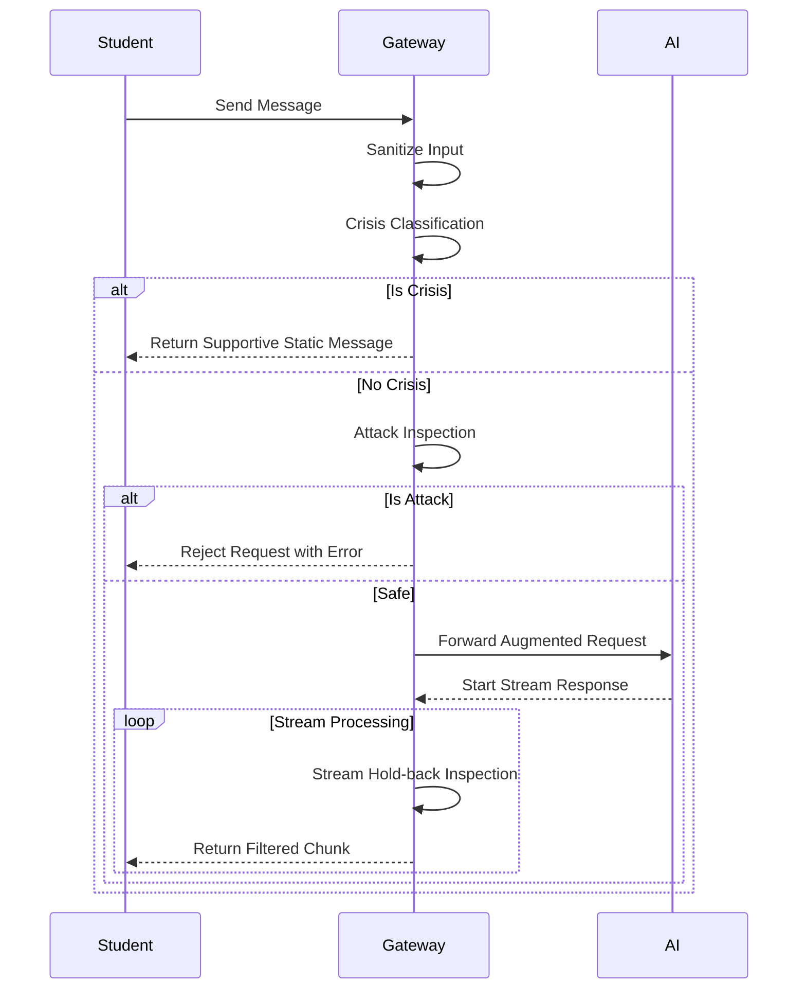

# SAIFE Gateway Architecture

The SAIFE Gateway serves as a secure, transparent intermediary layer positioned between the educational frontend and external Generative AI providers. Its primary architecture is designed around fail-closed principles, ephemeral state management, and pedagogical safety.

## The Gateway Pipeline

Every incoming message from a student is routed through a rigorous, linear pipeline designed to ensure safety and compliance before reaching an external AI endpoint. The pipeline operates in the following order:

1. **Input Sanitization:** User inputs are immediately sanitized (e.g., stripping reserved delimiter tokens) to prevent low-level injection framing.
2. **Crisis Classification:** The input is evaluated against a pattern-based crisis classifier to detect self-harm or emergencies.
3. **Attack Inspection:** A fast, linear-time regular expression engine (`re2`) scans the input for known prompt injection and jailbreak attacks. Salami-slicing (distributed attacks) are evaluated using session history.
4. **LLM Call:** If the input passes all safety checks, it is appended with the `TeacherFocusDirective` and safety ledger, and forwarded to the external AI model.
5. **Stream Hold-back Inspection:** The response stream from the AI is buffered into small windows and continuously inspected for inappropriate content or leaks before being yielded to the user.

### Why Crisis Evaluates First

The crisis classification pipeline executes before the attack inspection pipeline. This is a deliberate design decision to prioritize student welfare. If a student reaches out in crisis, we want to immediately provide supportive guidance without penalizing the request, rate-limiting it, or discarding it as a potential attack. Crisis overrides standard policy.

## Component Map

Below is a breakdown of the core components found in the `src/` directory:

| File | Purpose |
|---|---|
| `SaifeClient.ts` | The core gateway implementation containing the executeStream orchestrator, pipelines, and configuration validation. |
| `types.ts` | Defines the central configuration shapes, errors (`SaifeError`), and interface contracts for all storage and telemetry adapters. |
| `Sanitizer.ts` | Provides the `InputSanitizer` utility to strip reserved system tokens from raw input. |
| `InMemorySessionStore.ts` | A transient, ephemeral state store managing rate limits, penalty buckets, and conversation history. |
| `InMemoryCrisisStore.ts` | Volatile state store tracking detected crisis events per user (for dev/alpha use only). |
| `RedactionProvider.ts` | Contains logic to identify and replace student names or IDs from rosters to prevent PII leakage. |
| `RetentionJobs.ts` | Manages background cron schedules to enforce data minimization by evicting expired records from the stores. |
| `AuditSink.ts` | Development implementation for logging security events and errors. |
| `TelemetrySink.ts` | Aggregates anonymous, count-based metrics for dashboard usage without persisting sensitive data. |
| `WebhookCrisisTransport.ts` | Delivers asynchronous crisis alerts to designated school emergency contacts. |

## Request Sequence Diagram

## Storage Interfaces

To integrate the SDK into production, deployers must implement the following contracts using persistent, highly available storage:

- `ISessionStore`: Manages transient chat history and rate-limit buckets.
- `ICrisisStore`: Persists high-priority crisis events (Art. 9 data). Must support specific retention mandates.
- `IAuditSink`: Receives detailed, timestamped security logs and audit events for compliance tracking.
- `ITelemetrySink`: Receives aggregated, anonymous usage counts for dashboard analytics.
- `IRosterProvider`: Determines authorization and provides student names/IDs for the redaction engine.
- `IRedactionProvider`: Replaces PII with pseudonymized placeholders prior to external egress.
- `ICrisisAlertTransport`: Delivers critical alerts to external systems (e.g., SMS, email, webhook) without blocking the primary request thread.
